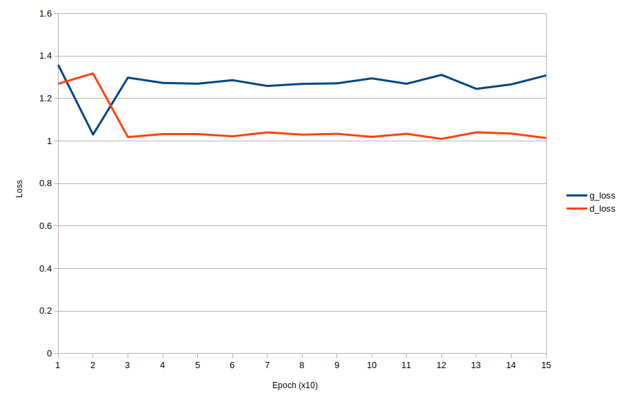
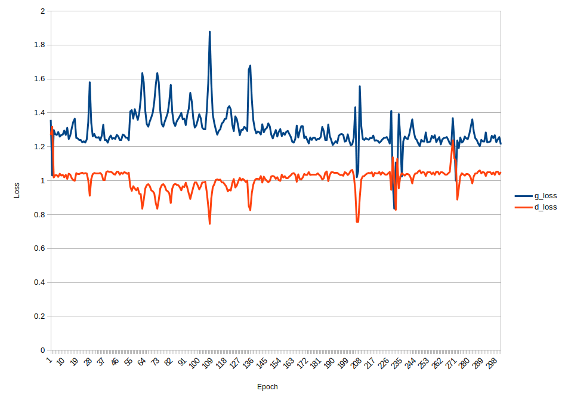

# Machine-Learning-2019
Assignments repository

# DCGAN
DCGAN is one of the popular and successful network design for GAN. It mainly composes of convolution layers without max pooling or fully connected layers. It uses convolutional stride and transposed convolution for the downsampling and the upsampling. The figure below is the network design for the generator.

DCGAN Architecture


# How to run
### Install 
* [TensorFlow](https://tensorflow.rstudio.com/installation/)
* [Keras](https://tensorflow.rstudio.com/reference/keras/install_keras/)
* [Tfdatasets](https://tensorflow.rstudio.com/guide/tfdatasets/introduction/)

## Train
If you cloned the whole repository 
### [Classic MNIST](https://github.com/petewarden/tensorflow_ios/blob/master/tensorflow/g3doc/tutorials/mnist/download/index.md) 
MNIST ("Modified National Institute of Standards and Technology") is the de facto “hello world” dataset of computer vision. Since its release in 1999, this classic dataset of handwritten images has served as the basis for benchmarking classification algorithms. As new machine learning techniques emerge, MNIST remains a reliable resource for researchers and learners alike.

Images—consisting of a training set of 60,000 examples and a test set of 10,000 examples. Each example is a 28x28 grayscale image, associated with a label from 10 classes(0~9).
```bash
Select session then set a working directory where the generated images will be saved.
Then, on r studio just select the line to execute and click run otherwise select all file scipt and click run
```

## Generator Output after 150 training iteration steps


## Discriminator and Generator Loss During training


## Fashion MNIST
### Dataset
* [Fashion MNIST](https://github.com/zalandoresearch/fashion-mnist) 
### Summary¶
Fashion-MNIST is a dataset of Zalando's article images—consisting of a training set of 60,000 examples and a test set of 10,000 examples. Each example is a 28x28 grayscale image, associated with a label from 10 classes. Zalando intends Fashion-MNIST to serve as a direct drop-in replacement for the original MNIST dataset for benchmarking machine learning algorithms.

### Data Description¶
Each image is 28 pixels in height and 28 pixels in width, for a total of 784 pixels in total. Each pixel has a single pixel-value associated with it, indicating the lightness or darkness of that pixel, with higher numbers meaning darker. This pixel-value is an integer between 0 and 255. The training and test data sets have 785 columns. The first column consists of the class labels (see above), and represents the article of clothing. The rest of the columns contain the pixel-values of the associated image.
### Labels
Each training and test example is assigned to one of the following labels:

0 T-shirt/top
1 Trouser
2 Pullover
3 Dress
4 Coat
5 Sandal
6 Shirt
7 Sneaker
8 Bag
9 Ankle boot

## Generator Output after 300 training iteration steps


## Generator Output after 300 training iteration steps


## Use Trained Model
### Save and Load the model 
```bash
save_model_hdf5(object, filepath, overwrite = TRUE,
  include_optimizer = TRUE)

load_model_hdf5(filepath, custom_objects = NULL, compile = TRUE)
```

