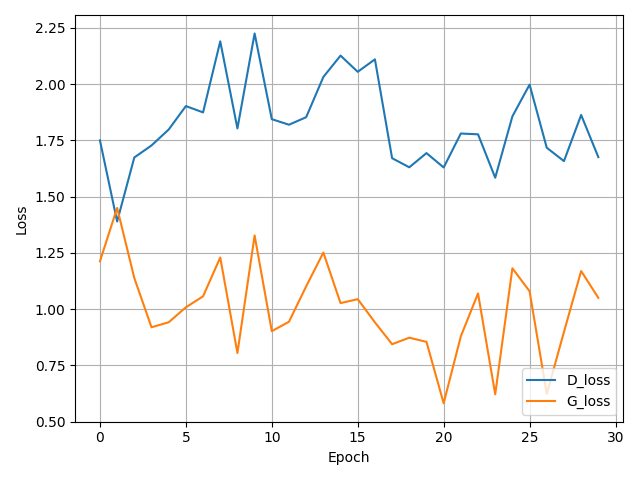
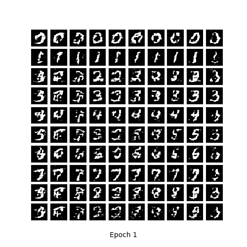
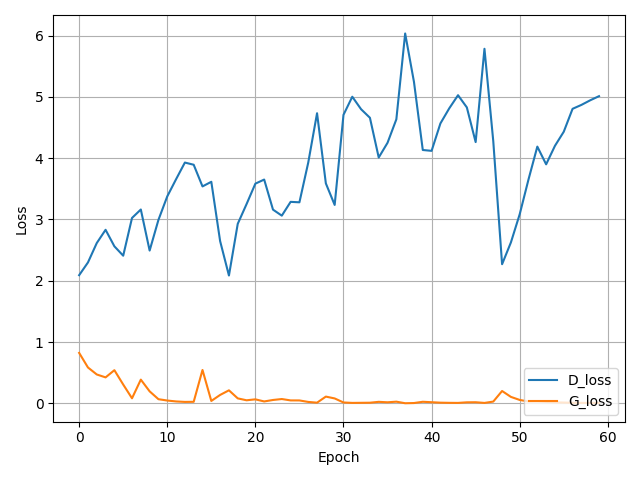

# Machine-Learning-2019
Assignments repository

# cDCGAN
DCGAN is one of the popular and successful network design for GAN. It mainly composes of convolution layers without max pooling or fully connected layers. It uses convolutional stride and transposed convolution for the downsampling and the upsampling. The figure below is the network design for the generator.

DCGAN Architecture


# How to run
### Install 
* [TensorFlow](https://www.tensorflow.org/install/)
* [Matplotlib](https://matplotlib.org/)
* [Imageio](https://imageio.readthedocs.io/en/stable/installation.html)
* [Numpy](https://docs.scipy.org/doc/numpy/user/install.html)

## Train
If you cloned the whole repository 
### Classic MNIST 
```bash
python Homework_3/cDCGAN/tensorflow_MNIST_cDCGAN.py
```
## My result for Discriminator and Generator Loss


## With this loss the generator output the following image sequence in gif


## Use Pretrained Model
### Load the model 

### Fashion MNIST 
```bash
python Homework_3/cDCGAN/tensorflow_F_MNIST_cDCGAN.py
```
## My result for Discriminator and Generator Loss


## With this loss the generator output the following image sequence in gif


## Use Pretrained Model
### Load the model 
