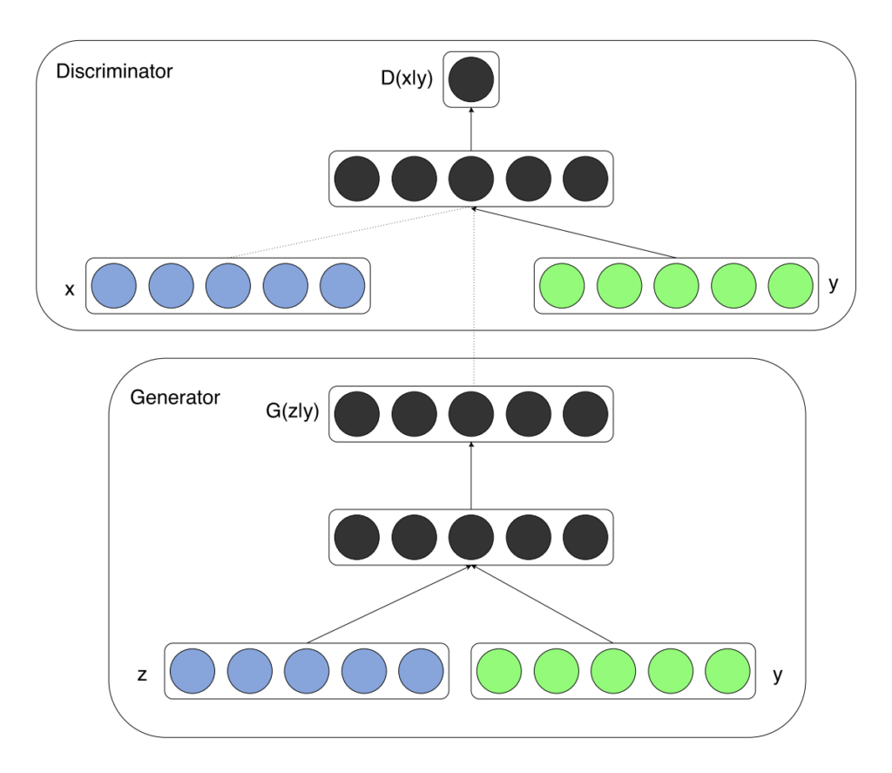

# Machine-Learning-2019
Assignments repository

# [CGAN (Conditional Generative Adversarial Network)](https://arxiv.org/abs/1411.1784.pdf) 
The conditional generative adversarial network, or cGAN for short, is a type of GAN that involves the conditional generation of images by a generator model. Image generation can be conditional on a class label, if available, allowing the targeted generated of images of a given type..

CGAN Architecture



# How to run
### Install 
* [TensorFlow](https://www.tensorflow.org/install/)
* [Matplotlib](https://matplotlib.org/)
* [Imageio] (https://imageio.readthedocs.io/en/stable/installation.html)
* [Numpy](https://docs.scipy.org/doc/numpy/user/install.html)

## Train CGAN
If you cloned the whole repository 
### Classic MNIST 
```bash
python Homework_3/src/tensorflow_MNIST_cGAN.py
```
## My result for Discriminator and Generator Loss


## With this loss the generator output the following image sequence in gif


## Use Pretrained Model
### Load the model 

### Fashion MNIST 
```bash
python Homework_3/src/tensorflow_F_MNIST_cGAN.py
```
## My result for Discriminator and Generator Loss


## With this loss the generator output the following image sequence in gif


## Use Pretrained Model
### Load the model 

