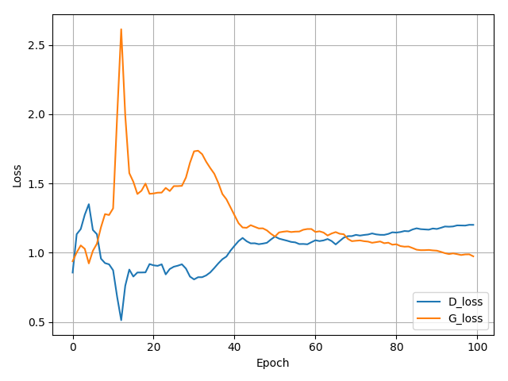
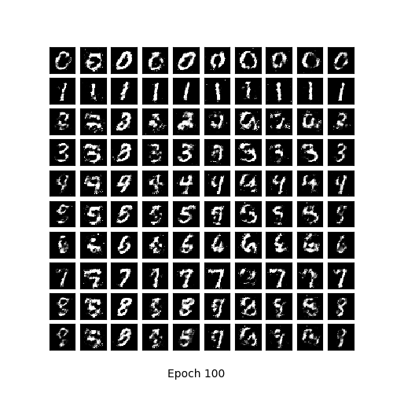
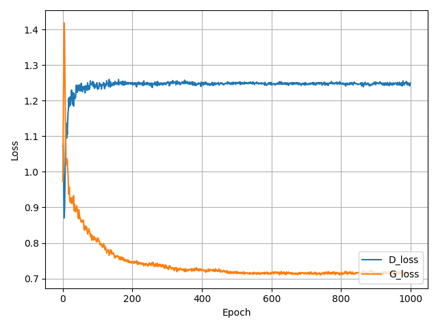
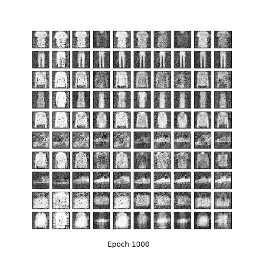

# Machine-Learning-2019
Assignments repository

# CGAN [(Conditional Generative Adversarial Network)](https://arxiv.org/abs/1411.1784.pdf) 
The conditional generative adversarial network, or cGAN for short, is a type of GAN that involves the conditional generation of images by a generator model. Image generation can be conditional on a class label, if available, allowing the targeted generated of images of a given type..

CGAN Architecture


x is a given input image or generated image by generator G when provided with random noise and target label y, fed to Discriminator D, so that D can tell if the image is real image or fake/generated image.

# How to run
### Install 
* [TensorFlow](https://www.tensorflow.org/install/)
* [Matplotlib](https://matplotlib.org/)
* [Imageio](https://imageio.readthedocs.io/en/stable/installation.html)
* [Numpy](https://docs.scipy.org/doc/numpy/user/install.html)

## Train CGAN
If you cloned the whole repository 
### Classic MNIST 
### Dataset
* [MNIST](https://github.com/petewarden/tensorflow_ios/blob/master/tensorflow/g3doc/tutorials/mnist/download/index.md)
Dataset contains greyscale 28x28 pixel images of handwritten digits.

### Train The Model from the scratch
```bash
python Homework_3/cGAN/tensorflow_MNIST_cGAN.py
```

## Graph shows result for Discriminator and Generator Training Loss


### Final output of the generator after 100 iteration during training


## Fashion MNIST 
### Train Model from Scratch
```bash
python Homework_3/cGAN/tensorflow_F_MNIST_cGAN.py
```

## Graph shows result for Discriminator and Generator Training Loss


### Final output of the generator after 1000 iteration during training



### Use Pretrained Model
### Load the model latest checkpoint
```bash
latest = tf.train.latest_checkpoint(checkpoint_dir)

# Create a new model instance
model = create_model()

# Load the previously saved weights
model.load_weights(latest)
```

